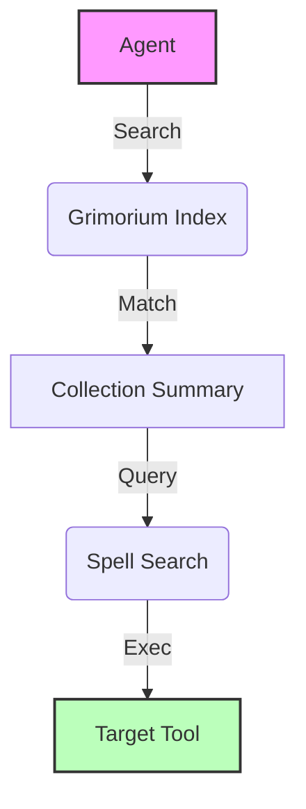

# Magetools

<p align="center">
  
</p>

<div class="grid cards" markdown>

-   :material-magnify: __Active Discovery__

    ---

    Discover tools from the filesystem at runtime. No hardcoding, no redeploys.

    [:octicons-arrow-right-24: Learn more](user_guide/core_concepts.md#active-discovery)

-   :material-shield-lock: __Strict Security__

    ---

    Cryptographic manifests and sanitized imports ensure your agents only run authorized code.

    [:octicons-arrow-right-24: View security](user_guide/security.md)

-   :material-brain: __Hierarchical Meta-Sync__

    ---

    Automatically generate technical summaries for collections to optimize agentic search.

    [:octicons-arrow-right-24: Explore metadata](user_guide/core_concepts.md#metadata-summaries)

-   :material-power-plug: __Provider Agnostic__

    ---

    Built-in support for Google GenAI and ChromaDB with graceful fallbacks.

    [:octicons-arrow-right-24: Getting started](user_guide/getting_started.md)

</div>

## 📽️ How it works

Magetools follows the **Hierarchical Active Discovery** pattern. Instead of giving an agent 5,000 tools at once, you give it the ability to browse and explore.



## 🚀 Quick Start in 30 Seconds

```bash
# Install with all features
uv add magetools[full]

# Initialize a new tool collection
uv run -m magetools init ./my_tools

# Build the search index and summaries
uv run -m magetools scan
```

---

<div align="center">
  [Getting Started](user_guide/getting_started.md){ .md-button .md-button--primary }
  [View GitHub](https://github.com/IAmNo1Special/magetools){ .md-button }
</div>
